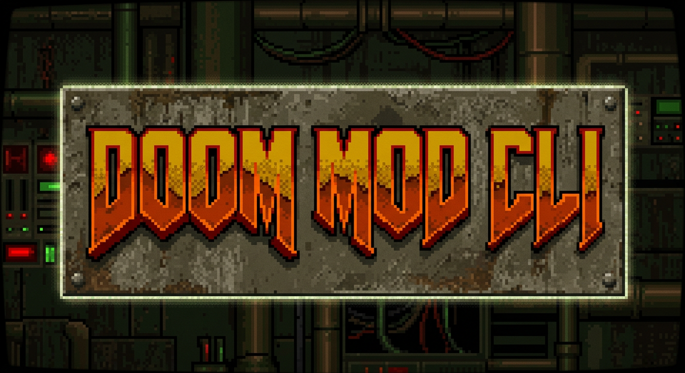

<p align="center">
  
</p>

<h1 align="center">Omgifol</h1>

<p align="center">
  <strong>A Python library for manipulating Doom WAD files</strong>
</p>

<p align="center">
  <a href="#installation">Installation</a> •
  <a href="#quick-start">Quick Start</a> •
  <a href="#features">Features</a> •
  <a href="#interactive-cli">CLI</a> •
  <a href="#api-reference">API Reference</a> •
  <a href="#license">License</a>
</p>

---

Omgifol lets you read, create, and modify Doom engine WAD files entirely from Python. Load IWADs and PWADs, extract and insert lumps, convert between image formats and Doom's graphic format, edit maps programmatically, batch-import PNG sprite sheets into ready-to-play WADs or PK3s, and generate DECORATE actor definitions — all from a few lines of code or the built-in interactive CLI.

## Installation

```bash
pip install omgifol
```

For graphic conversion (PNG/BMP import/export) and performance-critical palette matching:

```bash
pip install omgifol[graphics]   # installs Pillow + numpy
```

For audio import/export:

```bash
pip install omgifol[audio]      # installs soundfile + numpy
```

For AI background removal on sprites:

```bash
pip install omgifol[bgremove]   # installs rembg + Pillow
```

Or install everything at once:

```bash
pip install omgifol[graphics,audio,bgremove]
```

**Requires Python 3.9+**

## Quick Start

### Load a WAD and list its contents

```python
from omg import *

wad = WAD("DOOM2.WAD")

print("Sprites:", wad.sprites.keys()[:10])
print("Maps:", wad.maps.keys())
print("Sounds:", wad.sounds.keys()[:10])
```

### Extract a sprite to PNG

```python
from omg import *

wad = WAD("DOOM2.WAD")
wad.sprites["TROOA1"].to_file("trooper_front.png", mode="RGBA")
```

### Import a PNG as a sprite

```python
from omg import *

wad = WAD()
sprite = Graphic(from_file="my_sprite.png")
sprite.offsets = (32, 60)
wad.sprites["PLAYA1"] = sprite
wad.to_file("mymod.wad")
```

### Batch-import a folder of PNGs into a playable WAD

```python
from omg.spritetools import folder_to_wad

folder_to_wad(
    input_folder="./sprites/bezos/",
    output_wad="bezos.wad",
    actor_name="DoomBezos",
    sprite_prefix="BEZS",
    doomednum=14000,
    health=500,
    offset_mode="center-bottom",
    states={"Spawn": ["A", "B", "C", "D"]},
)
```

### Generate a PK3 instead

```python
from omg.spritetools import folder_to_pk3

folder_to_pk3(
    input_folder="./sprites/bezos/",
    output_pk3="bezos.pk3",
    actor_name="DoomBezos",
    sprite_prefix="BEZS",
    doomednum=14000,
    health=500,
)
```

### Edit a map

```python
from omg import *

wad = WAD("DOOM2.WAD")
editor = MapEditor(wad.maps["MAP01"])

for thing in editor.things:
    thing.x += 64

wad.maps["MAP01"] = editor.to_lumps()
wad.to_file("shifted.wad")
```

### Draw a sector from scratch

```python
from omg import *

wad = WAD()
editor = MapEditor()

sector = Sector()
sector.z_ceil = 128
sector.light = 255
sector.tx_floor = "FLAT14"
sector.tx_ceil = "FLAT14"

sidedef = Sidedef()
sidedef.tx_mid = "STARTAN3"

editor.draw_sector(
    [(0, 0), (256, 0), (256, 256), (0, 256)],
    sector=sector,
    sidedef=sidedef,
)

editor.things.append(Thing(x=128, y=128, angle=90, type=1))

wad.maps["MAP01"] = editor.to_lumps()
wad.to_file("box.wad")
```

## Features

### WAD I/O

| Capability | Description |
|---|---|
| **Read/Write WADs** | Load and save IWAD and PWAD files with automatic section detection |
| **Merge WADs** | Combine WADs with `wad1 + wad2` |
| **Low-level access** | `WadIO` for direct lump-level read/write without loading the full file |
| **Waste management** | Detect and reclaim wasted space with `WadIO.rewrite()` |

### Graphics & Sprites

| Capability | Description |
|---|---|
| **Format conversion** | Doom patch format ↔ PNG/BMP/JPG via Pillow |
| **Palette matching** | Fast numpy-vectorized RGB → palette index conversion |
| **Sprite offsets** | Read/write x,y offsets for proper in-game positioning |
| **Flat support** | Handle 64×64 floor/ceiling textures |
| **Batch import** | `SpriteSheet` class for multi-frame sprite management |
| **Auto-naming** | Automatic Doom sprite name assignment (prefix + frame + rotation) |
| **Mirror-5 mode** | 5-angle import with automatic mirroring for 8-rotation coverage |
| **PK3 output** | Export to ZDoom PK3 (ZIP) format with proper directory structure |

### Sprite Offset Modes

| Mode | Behavior |
|---|---|
| `center-bottom` | `x = width/2, y = height - 5` — standard for standing actors |
| `center` | `x = width/2, y = height/2` — projectiles, effects |
| `weapon` | `x = 160, y = 200 - height` — weapon sprites |
| `(x, y)` | Custom tuple for manual control |

### Auto-Naming Conventions

| Pattern | Example | Result |
|---|---|---|
| **Explicit** | `BEZSA1.png` | Uses the Doom name as-is |
| **Sequential** | `001.png`, `002.png` | Assigns frames A, B, C... rotation 0 |
| **Mirror-5** | 5 PNGs per frame | Rotations 1-5, mirrored to 6-8 |

### DECORATE Generation

```python
from omg.spritetools import generate_decorate

decorate = generate_decorate(
    actor_name="DoomBezos",
    sprite_prefix="BEZS",
    states_config={
        "Spawn": ["A", "B", "C", "D"],
        "Death": ["E", "F", "G"],
    },
    doomednum=14000,
    health=500,
    radius=20,
    height=56,
    flags=["+SOLID", "+SHOOTABLE", "+COUNTKILL"],
)
```

### Map Editing

| Capability | Description |
|---|---|
| **MapEditor** | Load/edit/save Doom and Hexen format maps |
| **UDMF** | Parse and write UDMF map format |
| **Struct types** | `Vertex`, `Linedef`, `Sidedef`, `Sector`, `Thing` (and Hexen variants) |
| **Draw sectors** | Programmatically create geometry with `draw_sector()` |
| **Paste maps** | Merge map content with offset support |
| **Line/Thing info** | Built-in lookup tables for linedef types and thing categories |

### Audio

| Capability | Description |
|---|---|
| **Sound import** | Convert WAV/OGG/FLAC → Doom DMX format via soundfile |
| **Sound export** | Convert DMX sounds to WAV/OGG/FLAC |
| **Format support** | PC speaker, MIDI sequence, MIDI note, digitized (8-bit PCM) |

### Texture Definitions

| Capability | Description |
|---|---|
| **TEXTURE1/2** | Read and write texture definition lumps |
| **PNAMES** | Manage patch name tables |
| **Composition** | Create textures from patches programmatically |

### PLAYPAL & COLORMAP

| Capability | Description |
|---|---|
| **Playpal editor** | Build pain, item pickup, and radiation suit palettes |
| **Colormap editor** | Generate brightness fade tables and invulnerability maps |
| **Custom palettes** | Create palettes from arbitrary color lists |

## Interactive CLI

Omgifol includes a full interactive command-line interface that exposes every capability of the library through guided menus.

```bash
python -m omg
```

The CLI provides:

- **WAD Operations** — Open, create, merge, inspect, and save WAD files
- **Lump Management** — List, extract, import, rename, and remove individual lumps
- **Sprite Pipeline** — Batch-import PNG folders with auto-naming, offsets, and DECORATE
- **Map Inspection** — View map stats (vertices, linedefs, sectors, things)
- **Graphic Conversion** — Convert between Doom graphics and standard image formats
- **Sound Conversion** — Convert between DMX sounds and audio files
- **Texture Editing** — List and inspect texture definitions
- **Palette Tools** — Export palette to PNG, rebuild colormaps and PLAYPALs

## CLI Script: png2wad

A standalone command-line tool for the sprite pipeline:

```bash
python scripts/png2wad.py ./my_sprites/ -o monster.wad \
    --actor "DoomBezos" --prefix "BEZS" \
    --doomednum 14000 --health 500 \
    --offset center-bottom \
    --states idle:A-D,walk:E-H,attack:I-K,death:L-P
```

Options:

| Flag | Description |
|---|---|
| `input_folder` | Folder containing PNG sprites |
| `-o / --output` | Output file path |
| `--format` | `wad` or `pk3` (default: wad) |
| `--actor` | DECORATE actor class name |
| `--prefix` | 4-char sprite prefix |
| `--replaces` | Actor class to replace |
| `--parent` | Actor class to inherit from |
| `--doomednum` | DoomEdNum for map editors |
| `--health` | Actor health |
| `--radius` | Collision radius (default: 20) |
| `--height` | Collision height (default: 16) |
| `--offset` | `center-bottom`, `center`, `weapon`, or `custom` |
| `--states` | State mapping (e.g. `idle:A-D,death:L-P`) |
| `--flags` | DECORATE flags (default: `+SOLID,+SHOOTABLE`) |
| `--mirror5` | 5-angle mirrored import mode |

## API Reference

### Core Classes

| Class | Module | Description |
|---|---|---|
| `WAD` | `omg.wad` | High-level WAD file representation with section-based access |
| `WadIO` | `omg.wadio` | Low-level WAD I/O for direct lump manipulation |
| `Lump` | `omg.lump` | Base lump class for raw binary data |
| `Graphic` | `omg.lump` | Doom patch-format graphic with PIL conversion |
| `Flat` | `omg.lump` | 64×64 floor/ceiling flat graphic |
| `Sound` | `omg.lump` | Doom DMX-format sound with audio file conversion |
| `Music` | `omg.lump` | Music lump (placeholder) |
| `Palette` | `omg.palette` | Color palette with RGB matching and blending |
| `MapEditor` | `omg.mapedit` | Map geometry editor with struct types |
| `SpriteSheet` | `omg.spritetools` | Multi-frame sprite manager for batch import |
| `Textures` | `omg.txdef` | TEXTURE1/2 and PNAMES editor |
| `Colormap` | `omg.colormap` | COLORMAP lump editor |
| `Playpal` | `omg.playpal` | PLAYPAL lump editor |

### WAD Sections

When you load a WAD, lumps are automatically sorted into sections:

```python
wad = WAD("DOOM2.WAD")

wad.sprites     # S_START..S_END marker group
wad.patches     # P_START..P_END marker group
wad.flats       # F_START..F_END marker group
wad.maps        # Header-grouped map lumps (MAP01, E1M1, etc.)
wad.sounds      # DS*, DP* named lumps
wad.music       # D_* named lumps
wad.graphics    # TITLEPIC, status bar, menu graphics, etc.
wad.txdefs      # TEXTURE1, TEXTURE2, PNAMES
wad.data        # Everything else
```

### Sprite Pipeline Functions

```python
from omg.spritetools import (
    SpriteSheet,          # manage sprite frames
    folder_to_wad,        # PNG folder → WAD with DECORATE
    folder_to_pk3,        # PNG folder → PK3 with DECORATE
    generate_decorate,    # generate DECORATE actor definition
    parse_states_spec,    # parse "idle:A-D,death:L-P" strings
)
```

## Project History

Originally created by **Fredrik Johansson** (2005). Maintained by **Devin Acker** since version 0.3.0. Modernized for Python 3.9+ with numpy-accelerated palette matching, sprite pipeline tools, and interactive CLI.

## License

MIT License — see [LICENSE](LICENSE) for details.
